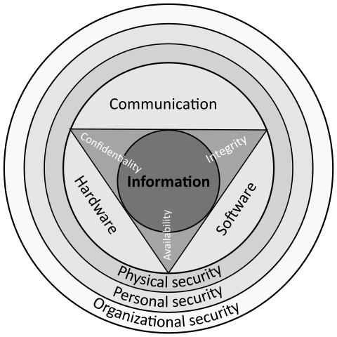

> **Key concepts in this module**: data flow diagram, LINDDUN, radical uncertainty, probability-impact matrix

So, you have a new product feature to implement. You have your functional requirements and an initial design. How does privacy fit into this phase of the development lifecycle? Now is the perfect time to do *privacy threat modeling*. Your threat model won't be static - you should absolutely revisit this later on, particularly if a major adjustment is made to the requirements or design - but now is the best time to begin threat modeling, before you write a single line of code or even commit to developing the feature. It's much less costly to identify potential concerns now, as you can adjust the design without needing to rewrite an in-progress implementation. And if you end up with a threat model full of high or critical risks, now is also the cheapest time to scrap the feature entirely.

## Security vs. Privacy Threat Modeling
In this section, I'll focus exclusively on privacy threat modeling, but of course the same cost arguments apply for doing security threat modeling *right now* too. Don't postpone it either, or you'll have (at best) missed deadlines and (at worst) data breaches and angry users to look forward to.

Why are security and privacy threat modeling different, though? Can't they be done at the same time by the same people? Well, the starting points for both are the same and can be combined: firstly, gathering all available design documentation, and secondly, creating a data flow diagram. From this point onwards, though, it helps to work on them separately, because you're identifying different threats and threat actors.

In security, you're considering the CIA triad and .... (exploit availability etc.)
In privacy, you're considering ...

TODO some threat actors will be the same but what they are trying to do is different. Probably most benefit from modeling separately and then security and privacy teams sync - can both learn from each other's thought processes.

## Data Flow Diagrams
Personally, I like [Miro](https://miro.com), but there are many other options available:
* Drawing tools such as diagrams.net or excalidraw
* Dedicated threat modeling tools such as Threat Dragon 
* And of course, if you're threat modeling together in person, you can simply whiteboard or use pen and paper. This does make it harder to maintain the threat model over time, however. It's a living document: your system won't stay static over time, and neither will your threats.

## LINDDUN
LINDDUN is a framework for identifying and managing privacy threats.

<button class="accordion-btn">Linkability</button>

Todo description here

<button class="accordion-btn">Identifiability</button>

Todo description here

<button class="accordion-btn">Non-Repudiation</button>

being unable to deny something. For example, ...

<button class="accordion-btn">Detectability</button>

Todo description here

<button class="accordion-btn">Disclosure of Information</button>

Todo description here

<button class="accordion-btn">Unawareness</button>

Todo description here

<button class="accordion-btn">Non-Compliance</button>

Todo description here

## Risk vs. Threats vs. Exploits vs. Vulnerabilities
These concepts are easy to confuse. One of the best metaphors I've seen explaining the difference was [tweeted](https://twitter.com/caseyjohnellis/status/1384277480979124232) by `@caseyjohnellis`. I quote:

* **Threat actor**: *"someone who wants to punch you in the face"*
* **Threat**: *"the punch being thrown"*
* **Exploit**: *"the fist"*
* **Vulnerability**: *"your inability to defend against the punch"*
* **Attack surface**: *"the size and shape of your face"*
* **Risk**: *"the likelihood of getting punched in the face"* (caveat: this is a simplification, see below)
* **Acceptable risk**: *"your willingness to be punched in the face"*
* **Risk posture**: (I paraphrase) *whether you know that a particular action is likely to get you punched in the face or not*
* **Mitigation**: todo
* **Asymmetric threat**: (I paraphrase) *carefully studying the security problem posed by punches and then getting kicked instead*
* **Threat intelligence**: *"the collection of photos of people who aren't allowed into the pub because of the time they punched someone in the face"*
* **Compliance**: (I love this!) *"how you think this all works until you've been punched in the face"*

Now let's apply this to privacy...TODO.

## Risk vs. Radical Uncertainty
What is risk?

* risk = probability x impact
* but this is a huge oversimplification

Both in threat modeling and in general when working on security or privacy, there can be a temptation to try to quantify everything. To avoid this, I think it is helpful to borrow the distinction in economics between *risk* and *uncertainty*. This distinction was first established in the 1920s in separate works by John Maynard Keyes (A Treatise on Probability) and Frank Knight (Risk, Uncertainty and Profit), and was recently repopularized by an excellent book by John Kay and Mervin King, *Radical Uncertainty: Decision-making for an unknowable future*, who point out that is relevant for us throughout modern life, not just in economics.

* wicked problems
* complement with Lea's rant on meaningless numbers

While trying to assign precise numbers to privacy risks is a mistake that should be avoided, it's certainly helpful to have a rough sense of a risk's "size" so that you can compare risks with one another to prioritize your mitigation efforts. While in an ideal world, all privacy risks would be perfectly mitigated and we wouldn't need to prioritize, we all know that's not the world we live in. So what can you do? There are a range of heuristics people use, but a good standby is the probability-impact matrix.

* https://www.suerf.org/suer-policy-brief/16053/radical-uncertainty
* https://www.openglobalrights.org/radical-uncertainty-and-human-rights/
* https://www.aei.org/economics/decision-making-in-an-age-of-radical-uncertainty-my-long-read-qa-with-mervyn-king/
* https://www.thegovernancepost.org/2021/03/howtosurviveradicaluncertainty/
* https://athenarium.com/radical-uncertainty-mervyn-king-john-kay/
* https://www.oecd.org/naec/events/understanding-the-economy/Radical_Uncertainty_John_Kay.pdf

## Prioritizing Risks with a Probability-Impact Chart

 to critical (in the top right).")

1. For each risk, decide if it's `unlikely`, `somewhat likely` (a.k.a. `I don't know`), or `very likely` to happen. This determines where the risk should be placed on the y-axis.
2. Now decide if the impact of it happening is `low`, `medium`, or `high`. This determines where the risk should go on the x-axis.

  * **Low**: if this happened to you, you'd probably shrug and move on. You wouldn't lose any sleep over it.
  * **Medium**: if this happened to you, you'd be upset and it would take considerable effort to sort things out. You might be humiliated, have to apologize to your boss or your family, or lose some money. You would lose sleep over this.
  * **High**: if this happened to you, it would turn your life upside down. You might end up seriously hurt, imprisoned, or financially ruined.
  * Don't forget that while "if this happened to you" is a good way to get started imagining potential impacts, your users may be in very different circumstances to you. Try to keep some of the cultural and legal differences we discussed earlier in the course in mind. As one example: a beach photo of a woman in a bikini accidentally being being made public might be low impact for a user whose cultural context is the US. Whereas for a female user based in the Gulf, their whole family might lose their jobs over the single photo.

3. Now consider **how many users** could be impacted by this risk. If many users could be affected, the risk should probably move up an impact category. If you've already assessed it as high impact *and* a large number of users could be affected, then it's really time to sound the alarm - this risk needs immediate mitigation.

4. As a final impact adjustment, you can also consider the impact for your company (e.g. financial, reputational), if relevant. But for many privacy risks, overwhelmingly the impact falls on the individual user(s).

5. Once you've done steps 1-4 for each risk, plot them on the chart and use this to guide your prioritization. This is just a guideline to get you started; you can adjust the positions based on your past experience, your company's context, or simply a gut feeling that a risk is more troubling than it seems. 

## Resources
* [OWASP Threat Modeling Cheat Sheet](https://cheatsheetseries.owasp.org/cheatsheets/Threat_Modeling_Cheat_Sheet.html)
* *Radical Uncertainty: Decision-making for an unknowable future*, Mervyn King and John Kay, Hachette UK (2020)
* [Invited Talk: Metric Perversity and Bad Decision-Making - USENIX Engima 2023](https://www.youtube.com/watch?v=doelnwoYzCw) - Lea Kissner

## Image Attribution
* [The Information Security triad: CIA. Second version - Michael Bakni, Wikimedia Commons. Licensed CC BY-SA 4.0](https://commons.wikimedia.org/wiki/File:CIAJMK1209-en.svg)

